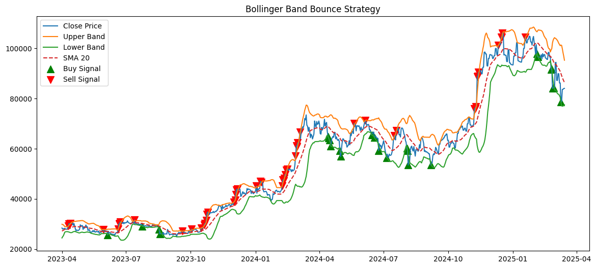
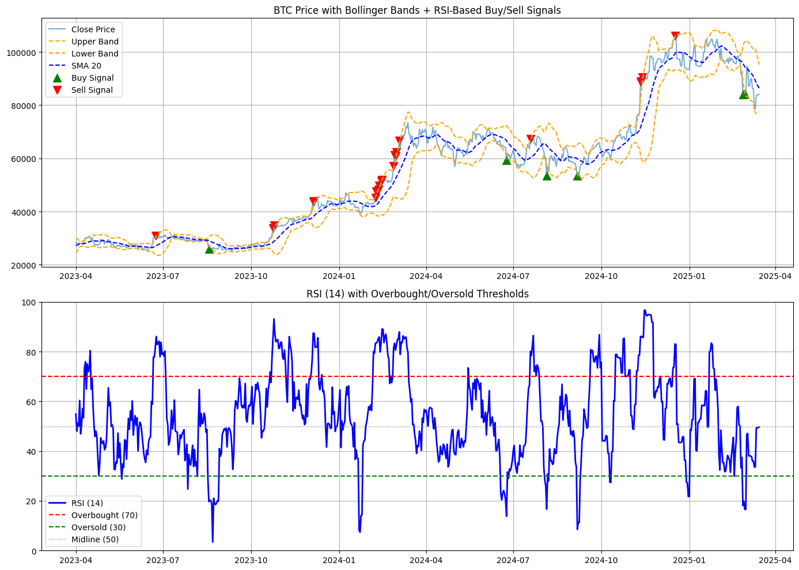
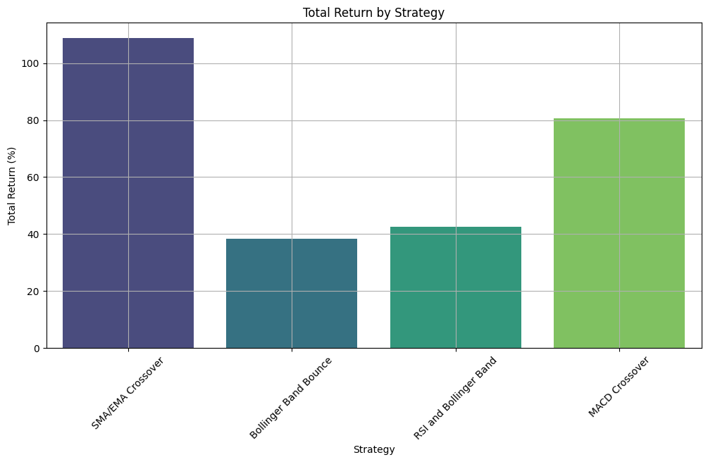
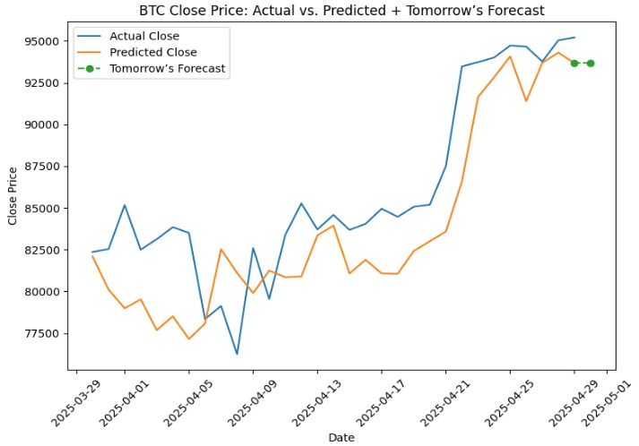
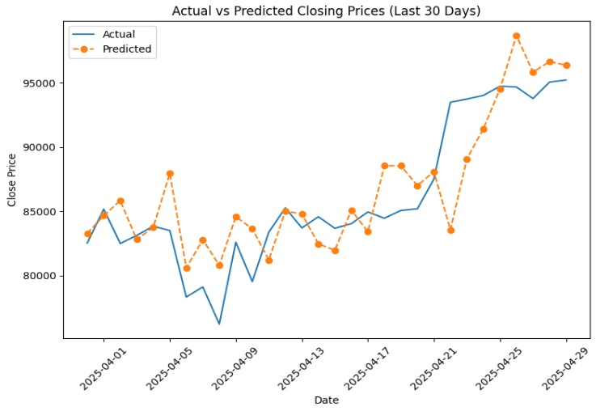

#  Bitcoin Price Analysis

##  Project Overview

This project explores the price dynamics of Bitcoin using Python. It aims to understand short- and long-term market behavior through a wide range of technical indicators and volatility metrics. This analysis helps reveal potential entry/exit signals and assess overall market sentiment and risk.
First part includes cleaning historical data and keep the required columns and then building various indicators on top of the historical data which is done by Excel and Python. Second part includes machine learning (ML) based forecasting using XGBoost and TCN 2 famous ML models. Third and final part will be Power BI interactive visualizations to deliver a complete end-to-end financial analysis pipeline.

Note: Nothing in this project is financial advice and is only implemented for research purposes.

---

##  Goals

- Analyze historical Bitcoin prices across multiple timeframes.
- Calculate and visualize widely-used technical indicators.
- Assess volatility, return patterns, and trading signals.
- Machine learning (ML) based forecasting using XGBoost (regression) and TCN (tensorflow and keras).
- Design an interactive Power BI dashboard (coming soon).

---

##  Tools & Technologies

- **Languages**: Python (Pandas, NumPy, Matplotlib, Seaborn, TA-Lib, ML(scikit-learn, XGBoost, Tensorflow, Keras), Power BI
- **Data Format**: CSV and Parquet files (multiple timeframes)
- **Visualization**: Matplotlib, Seaborn
- **More sources**: Binance news(api), alternative(api), coinalyze(api)

---

##  Folder Structure

```
Bitcoin_Price_Analysis/
├── data/                # Raw & processed data (csv and parquet)
├── notebooks/           # Jupyter Notebooks
├── images/              # Strategy plots & screenshots
├── requirements.txt     # Python packages used
└── README.md            # Project documentation

Bitcoin_derivatives/
├── output/              # Processed data (csv and parquet)
├── notebooks/           # Jupyter Notebooks
└── utils/               # scripts

Bitcoin_sentiments/
├── outputs/             # Raw & processed data (csv and parquet)
├── notebooks/           # Jupyter Notebooks
├── requirements.txt     # Python packages used
└── utils/               # scripts

ml_models/
├── input-output/        # Raw & processed data (csv and parquet)
├── notebooks/           # Jupyter Notebooks
└── requirements.txt     # Python packages used
```

---

##  Technical Indicators Used

This analysis applies the following indicators:

### 1. **Simple & Exponential Moving Averages**
- `SMA_20`, `SMA_50`, `SMA_100`, `SMA_200`
- `EMA_20`, `EMA_50`, `EMA_100`, `EMA_200`
-  Used to identify trend direction and momentum shifts.

### 2. **RSI (Relative Strength Index)**
- `RSI_14` with overbought/oversold detection
- `RSI_Crossover` flags key reversal zones (crossing above 70 or below 30)

### 3. **MACD (Moving Average Convergence Divergence)**
- `MACD`, `MACD_Signal`, `MACD_Histogram`
- Momentum analysis & buy/sell signal crossovers

### 4. **Bollinger Bands**
- `Upper_Band_20`, `Lower_Band_20`, with SMA center
- Price volatility envelope for breakout detection

### 5. **VWAP (Volume Weighted Average Price)**
- Intraday average price weighted by volume
- Common institutional benchmark

---

##  Volatility & Return Metrics

###  Return Calculations:
- **Daily Return**: `Close.pct_change()`
- **Cumulative Return**: `(1 + Daily_Return).cumprod()`

###  Volatility:
- **14-day Rolling Volatility** using standard deviation of returns
- **Categorization**:
  - Very Stable, Stable, Normal, High, Extreme

###  Other Metrics:
- **High-Low Spread**: Measures intraday volatility
- **Typical Price**: `(High + Low + Close) / 3`
- **Volume Profile** (planned for Power BI)

---

##  Visual Strategies Implemented

- SMA/EMA Golden/Death crosses
- MACD histogram shaded by momentum polarity
- Bollinger Band Bounce
- RSI+Bollinger Bands

---


##  Getting Started

Download Dataset from Kaggle: https://www.kaggle.com/datasets/mczielinski/bitcoin-historical-data
Clone the repo and run the notebooks: (Need to change paths carefully to dataset and send results as input of the next stage)

```bash
git clone https://github.com/movahed-abdolahi/Bitcoin-project.git
cd Bitcoin-project
pip install -r requirements.txt
jupyter notebook
```

---

##  Sample Visuals






---

##  Backtesting

Assumptions:
- Capital: $100,000 initial
- Trade Size: 100% capital (no compounding, 1 position at a time)
- Entry on next candle after signal
- Exit on next opposite signal
- No slippage or fees (for simplicity)
- Tested over 2-year period from April 2023 to April 2025



- Best performing: SMA/EMA crossovers
- Worst performing: Bollinger Band Bounce


---

##  ML Results


Predicting last 30 days of dataset and forecasting one day after:
  MSE: 11469354.4598
  MAE: 2808.0343
  R² : 0.6052


Predicting last 30 days of dataset:



---

##  License

MIT License

---

## 🤝 Let's Connect

Want to discuss the project or collaborate on crypto analytics?  
[LinkedIn](https://www.linkedin.com/in/movahed-abdolahi/) | [GitHub](https://github.com/movahed-abdolahi)
