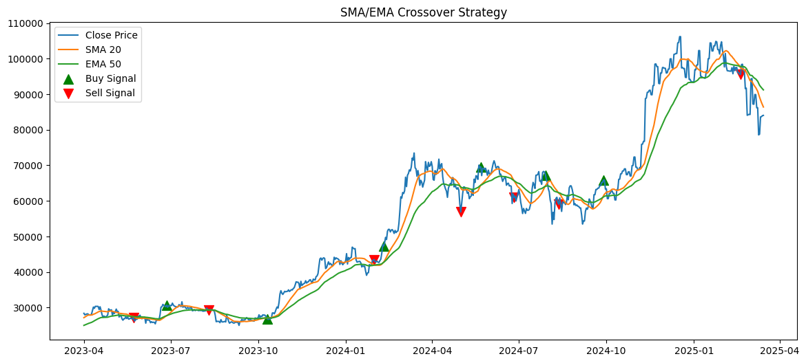
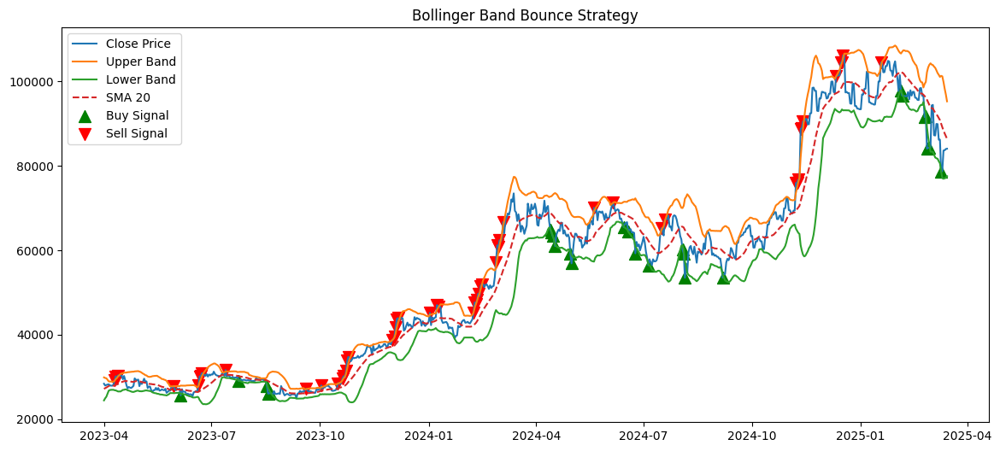
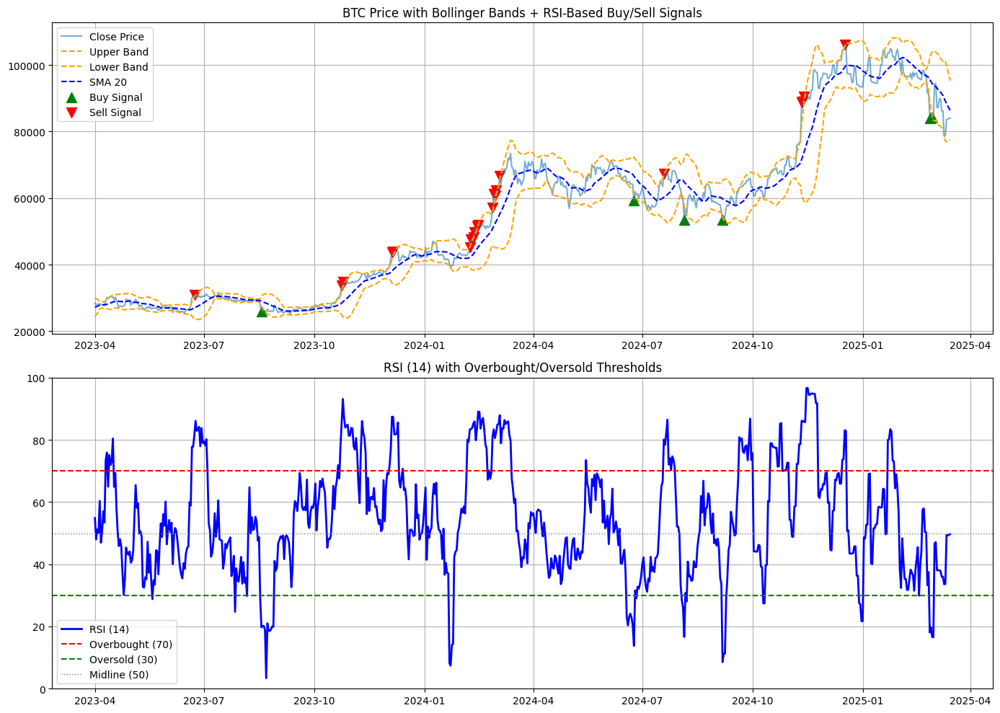
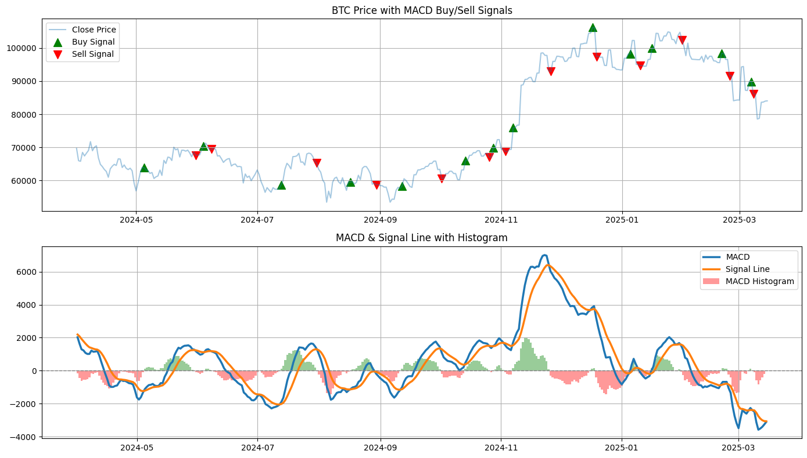

# 📊 Bitcoin Price Analysis with Python

## 🧠 Project Overview

This project explores the price dynamics of Bitcoin using Python. It aims to understand short- and long-term market behavior through a wide range of technical indicators and volatility metrics. This analysis helps reveal potential entry/exit signals and assess overall market sentiment and risk.
Future stages will include machine learning-based forecasting and Power BI visualizations to deliver a complete end-to-end financial analysis pipeline.

Note: Signals in this project are not financial advices. Trade at your own risk.

---

## 🎯 Goals

- Analyze historical Bitcoin prices across multiple timeframes.
- Calculate and visualize widely-used technical indicators.
- Assess volatility, return patterns, and trading signals.
- Lay the groundwork for predictive modeling (coming soon).
- Design an interactive Power BI dashboard (coming soon).

---

## 🧰 Tools & Technologies

- **Languages**: Python (Pandas, NumPy, Matplotlib, Seaborn, TA-Lib, ML models(scikit-learn, XGBoost), Power BI)
- **Data Format**: Parquet files (multiple timeframes)
- **Visualization**: Matplotlib, Seaborn

---

## 📁 Folder Structure

```
Bitcoin_Price_Analysis/
├── data/                # Raw & processed data (parquet)
├── notebooks/           # Jupyter Notebooks
├── images/              # Strategy plots & screenshots
├── requirements.txt     # Python packages used
└── README.md            # Project documentation
```

---

## 📊 Technical Indicators Used

This analysis applies the following indicators:

### 1. **Simple & Exponential Moving Averages**
- `SMA_20`, `SMA_50`, `SMA_100`, `SMA_200`
- `EMA_20`, `EMA_50`, `EMA_100`, `EMA_200`
- 📈 Used to identify trend direction and momentum shifts.

### 2. **RSI (Relative Strength Index)**
- `RSI_14` with overbought/oversold detection
- `RSI_Crossover` flags key reversal zones (crossing above 70 or below 30)

### 3. **MACD (Moving Average Convergence Divergence)**
- `MACD`, `MACD_Signal`, `MACD_Histogram`
- Momentum analysis & buy/sell signal crossovers

### 4. **Bollinger Bands**
- `Upper_Band_20`, `Lower_Band_20`, with SMA center
- Price volatility envelope for breakout detection

### 5. **VWAP (Volume Weighted Average Price)**
- Intraday average price weighted by volume
- Common institutional benchmark

---

## 📈 Volatility & Return Metrics

### ✅ Return Calculations:
- **Daily Return**: `Close.pct_change()`
- **Cumulative Return**: `(1 + Daily_Return).cumprod()`

### ✅ Volatility:
- **14-day Rolling Volatility** using standard deviation of returns
- **Categorization**:
  - Very Stable, Stable, Normal, High, Extreme

### ✅ Other Metrics:
- **High-Low Spread**: Measures intraday volatility
- **Typical Price**: `(High + Low + Close) / 3`
- **Volume Profile** (planned for Power BI)

---

## 📊 Visual Strategies Implemented

- SMA/EMA Golden/Death crosses
- MACD histogram shaded by momentum polarity
- Bollinger Band Bounce
- RSI+Bollinger Bands

---


## 🚀 Getting Started

Download Dataset from Kaggle: https://www.kaggle.com/datasets/mczielinski/bitcoin-historical-data
Clone the repo and run the notebooks: (Need to change path to dataset)

```bash
git clone https://github.com/movahed-abdolahi/Bitcoin-project.git
cd Bitcoin-project
pip install -r requirements.txt
jupyter notebook
```

---

## 🖼 Sample Visuals






---

## 📜 License

MIT License

---

## 🤝 Let's Connect

Want to discuss the project or collaborate on crypto analytics?  
[LinkedIn](https://www.linkedin.com/in/movahed-abdolahi/) | [GitHub](https://github.com/movahed-abdolahi)
